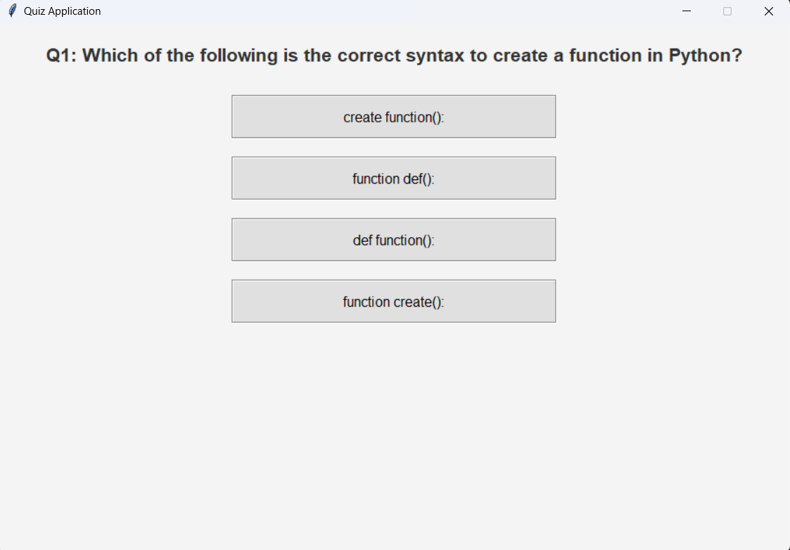

# QuizApp Application

This Python-based Quiz Application provides an interactive platform for users to test their knowledge through multiple-choice questions. Built using the tkinter library, the application features a clean, professional interface with responsive design elements.

<h2>Key Features:</h2>
<b>1 Interactive UI:</b> A simple and modern graphical interface for an engaging user experience. 
<b>2 Multiple-Choice Questions:</b> Each question includes four options, with one correct answer. 
<b>3 Dynamic Feedback:</b> Real-time evaluation of answers, tracking the user's score. 
<b>4 Responsive Buttons:</b> Professional button design with hover effects for a polished look. 
<b>5 Score Summary:</b> A final score report displayed at the end of the quiz. 

